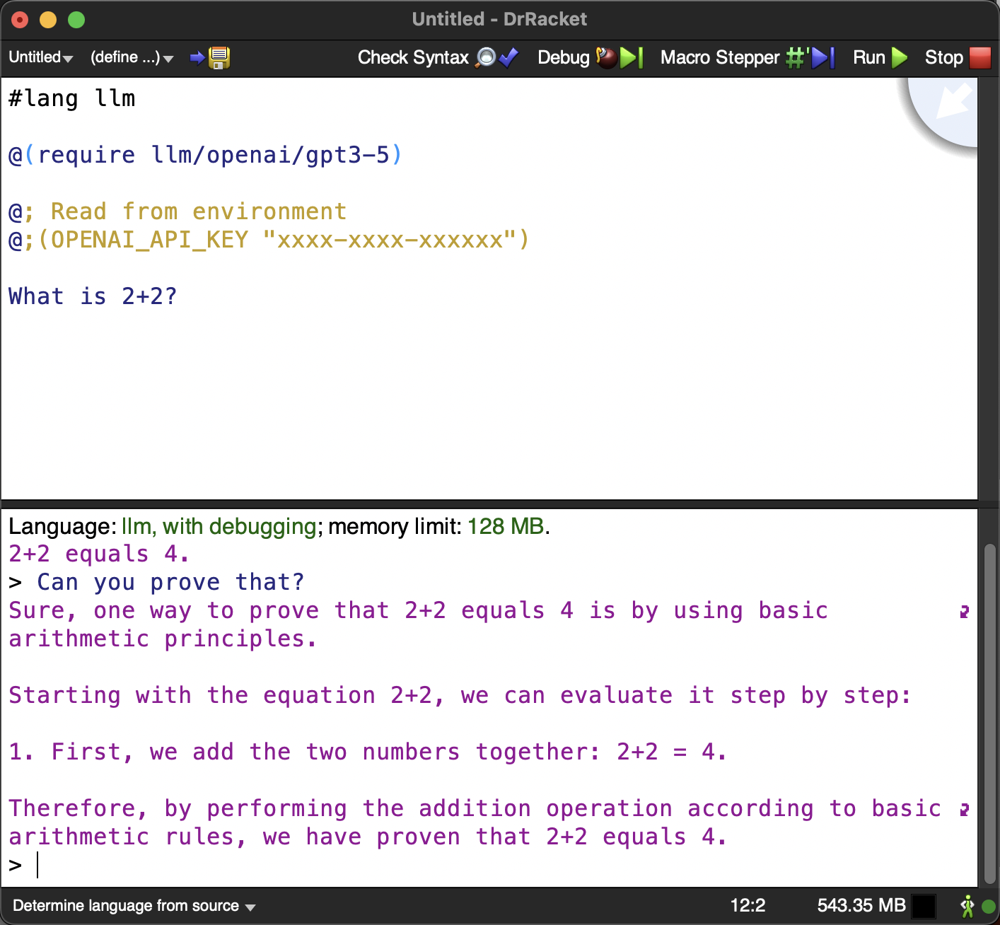

llm-lang
========
A language for interacting with LLMs. Inspired by GenAIScript (https://github.com/microsoft/genaiscript).



See [demo.mp4](demo.mp4) for a usage demo video.

Install with `raco pkg install llm` or `raco pkg install https://github.com/wilbowma/llm-lang.git?path=llm#main`.
Then open the docs, `raco doc llm`, to see more!

This llm-lang is LLM-first: by default, you're writing a prompt to send to a LLM.
llm-lang uses the at expression reader (https://docs.racket-lang.org/scribble/reader.html#(part._.The_.Scribble_.Syntax_at_a_.Glance)), so you can escape from your prompt using `@` forms to compute part of the prompt.
When you want to perform normal computation, you escape into the Racket programming language using `@` forms.
For example, the following configure an LLM backend and ask "Are you working correctly?", `display`ing the reply.

```
#lang llm

@(require llm/ollama/phi3)

Are you working correctly?
```

```
#lang llm

@(require llm/openai/gpt3-5)

@(OPENAI_API_KEY "xxxx-xxxx-xxxxxxxx")

Are you working correctly?
```

To run an llm-lang program, simply run it as a Racket program: `racket -t example1.rkt`, for example.
The above examples will display some variation on the following:
> Yes, I'm functioning properly. How can I assist you further? Whether it's answering questions or helping with tasks, I'm here to help!

The return value of any top-level expression is added to the prompt, except the values `""` and `(void)`, or any explicitly `unprompt`ed expression.
Non-expressions, such as definitions, and statements do not add values to the prompt.
The current prompt is sent sent at the next call to `prompt!`, which returns the response from the LLM.
There is an implicit call to `prompt!` at the end of every module.

An explicit call to `prompt!` will let you capture the response and perform further computation.
See [example2.rkt](example2.rkt) for a slightly more complex example.

This LLM-first approach to prompts is the main difference in design between this and GenAIScript, although llm-lang is extremely feature-poor as I wrote it in an afternoon.

The language is designed to support multiple backends, but only currently implements Phi-3 via Ollama (https://ollama.com) and GPT 3.5 Turbo (https://platform.openai.com/docs/models/gpt-3-5-turbo).
These backends are configured by setting certain configuration variables, usually by requiring a file as in the above example.
Read [config.rkt](config.rkt) and [ollama/phi3.rkt](ollama/phi3.rkt) to figure out how to write new backends; it's not complicated, because the system doesn't support much yet.

I haven't thought about getting back more than text output, or configuring initial prompts, or streaming, or AICI, or pretty much anything.
